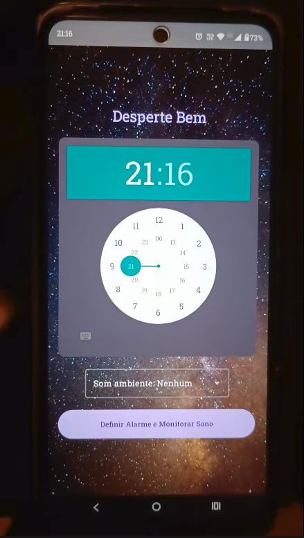

# 🌙 Desperte Bem

Aplicativo Android desenvolvido em **Kotlin + Jetpack Compose** que monitora o ruído ambiente antes do alarme tocar, exibindo uma animação sonora em tempo real e um gráfico final com os níveis de decibéis capturados.

---

## 📚 Índice

- [📖 Sobre o Projeto](#-sobre-o-projeto)
- [🎥 Vídeo de Demonstração](#-vídeo-de-demonstração)
- [✨ Funcionalidades](#-funcionalidades)
- [🛠 Tecnologias Utilizadas](#-tecnologias-utilizadas)
- [📱 Fluxo do Aplicativo](#-fluxo-do-aplicativo)
- [🎤 Captura de Áudio](#-captura-de-áudio)
- [🌊 Animação em Tempo Real](#-animação-em-tempo-real)
- [⏰ Agendamento de Alarmes](#-agendamento-de-alarmes)
- [🔐 Permissões](#-permissões)
- [▶️ Como Executar](#️-como-executar)
- [⚠️ Limitações](#️-limitações)
- [🚀 Melhorias Futuras](#-melhorias-futuras)
- [👨‍💻 Autores](#-autores)

---

## 📖 Sobre o Projeto

O **Desperte Bem** foi desenvolvido com o objetivo de criar um despertador inteligente capaz de monitorar o ambiente antes do alarme tocar.

Durante o período de gravação, o aplicativo captura o ruído ambiente em tempo real, converte os valores de amplitude para decibéis e exibe uma animação contínua representando a onda sonora capturada.

Ao final do processo, o usuário visualiza um gráfico completo contendo todos os níveis de ruído registrados.

---

## 🎥 Vídeo de Demonstração

<a href="https://www.youtube.com/shorts/ezKvdWh9KrM">
  
</a>

---

## ✨ Funcionalidades

- ⏰ Configuração de horário para alarme
- 🎤 Captura contínua de áudio ambiente
- 🌊 Animação sonora em tempo real
- 📈 Exibição de gráfico final dos decibéis
- 🔔 Agendamento de alarmes exatos
- 🔐 Solicitação automática de permissões necessárias

---

## 🛠 Tecnologias Utilizadas

O projeto utiliza as seguintes tecnologias e bibliotecas:

- **Kotlin**
- **Jetpack Compose**
- **MediaRecorder (captura de áudio)**
- **Vico Chart Library (gráficos e animação de onda)**
- **AlarmManager (agendamento de alarmes)**
- **Activity Result API (permissões)**

---

## 📱 Fluxo do Aplicativo

### 1️⃣ Tela de Configuração do Alarme

Nesta etapa, o usuário define o horário do alarme utilizando um `TimePicker`.

### Fluxo:
- o usuário escolhe hora e minuto;
- o aplicativo agenda o alarme com `AlarmManager`;
- verifica permissões de áudio;
- inicia a gravação caso permitido;
- solicita permissões se necessário.

---

### 2️⃣ Tela de Gravação (`BlankRecordingScreen`)

Durante a gravação:

- o aplicativo utiliza `MediaRecorder` para capturar o áudio ambiente;
- realiza leitura de amplitude a cada `200 ms`;
- converte os valores para decibéis;
- atualiza os dados exibidos na animação em tempo real.

### Atualização dos dados:
- `samples` → armazena todos os valores capturados;
- `liveEntries` → mantém apenas os dados necessários para a animação.

---

### 🌊 Exemplo da animação em tempo real

```kotlin
Chart(
    chart = lineChart(),
    model = entryModelOf(*liveEntries.toTypedArray())
)
```

O gráfico é atualizado dinamicamente, produzindo uma visualização contínua da onda sonora em tempo real.

---

### 3️⃣ Tela de Gráfico Final (`GraphScreen`)

Ao término da gravação ou ao selecionar **Skip**, o aplicativo:

- exibe um gráfico completo com todos os decibéis registrados;
- permite reiniciar o processo de monitoramento.

---

## 🎤 Captura de Áudio

A captura do áudio ambiente é realizada através do `MediaRecorder`:

```kotlin
mediaRecorder.maxAmplitude
```

Os valores de amplitude são convertidos para decibéis utilizando:

```kotlin
20 * log10(amplitude)
```

Esses dados alimentam:
- a animação da onda sonora;
- o gráfico final de ruído.

---

## 🌊 Animação em Tempo Real

A animação sonora é gerada utilizando a biblioteca **Vico Chart Library**.

Para garantir fluidez e leveza na renderização, a lista `liveEntries` mantém apenas os últimos 60 valores:

```kotlin
if (liveEntries.size > 60) {
    liveEntries.removeAt(0)
}
```

Esse comportamento produz uma onda contínua e responsiva durante toda a captura.

---

## ⏰ Agendamento de Alarmes

O alarme é configurado utilizando:

```kotlin
alarmManager.setExactAndAllowWhileIdle(...)
```

O aplicativo também verifica se o usuário concedeu permissão para utilização de alarmes exatos em dispositivos Android 12+.

---

## 🔐 Permissões

O aplicativo solicita as seguintes permissões:

| Permissão | Finalidade |
|---|---|
| `RECORD_AUDIO` | Captura do áudio ambiente |
| Alarmes Exatos | Agendamento preciso do alarme |

---

## ▶️ Como Executar

### Pré-requisitos

- Android Studio atualizado
- Dispositivo Android físico (recomendado)

### Passos

1. Clone o repositório:

```bash
git clone https://github.com/seu-usuario/desperte-bem.git
```

2. Abra o projeto no Android Studio

3. Execute o aplicativo em um dispositivo físico

4. Configure um horário para o alarme

5. Permita o acesso ao microfone

6. Observe a animação sonora em tempo real

---

## ⚠️ Limitações

- O emulador Android pode não capturar áudio real corretamente.
- A animação pode permanecer estática em ambientes sem entrada de áudio.
- Recomenda-se utilizar um dispositivo físico para testes completos.

---

### Arquivos Importantes

| Arquivo | Responsabilidade |
|---|---|
| `MainActivity.kt` | Lógica principal do aplicativo |
| `AlarmReceiver.kt` | Recebimento do alarme |
| `build.gradle.kts` | Dependências do Compose e Vico |

---

## 🚀 Melhorias Futuras

- 🎵 Adicionar sons personalizados para o alarme
- 🗂 Criar histórico de gravações
- 📤 Exportar gráficos
- 🤖 Detectar padrões de ruído
- ☁️ Sincronização em nuvem
- 📊 Estatísticas de qualidade do sono

---

## 👨‍💻 Autores

Projeto desenvolvido por:

- Argeu Piai
- Beatriz Macedo Mollica
- Brunna Pinheiro
- Bruno José Ferreira Ribeiro
- Ricardo H. Jr. K. Lopes
- Victoria Macedo Mollica

---

## 📄 Licença

Este projeto possui finalidade acadêmica e educacional.
